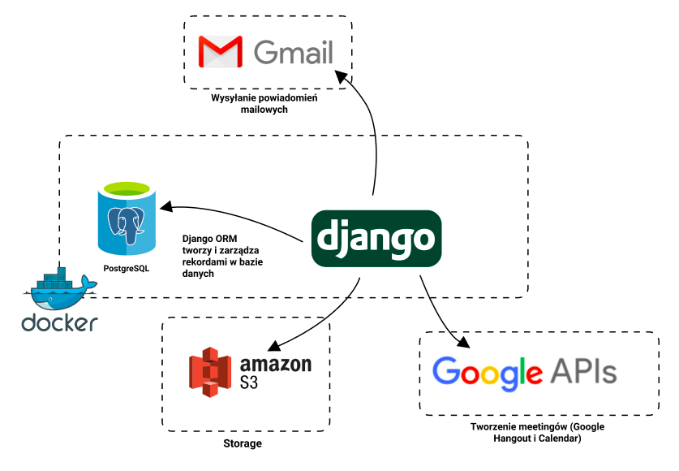

<h2 align="center">Raven - smart learning</h2>

</img> 

## The goal

**Raven** is an improved version of the well-known moodel, which combines the key functionalities of various university systems. The application is designed to make it easier for students and academic teachers to use e-learning services.

The main assumption of the application is to improve the workflow, automate the course, communication between users and increase the efficiency of teaching.

### Used technologies
The technological stack of the system was selected taking into account our skills, knowledge of programming environments and design requirements. Due to limited resources
(mainly time) - we will use ready-made solutions and libraries that will allow us to develop the project effectively.
* Backend:
  * `Django 3.0+`
  * `Django REST Framework`
  * `PostgreSQL`
  * `Redis` & `Celery`
* Frontend:
  * `VueJS`
  * `TailwindCSS`
* Testing tools:
  * `pytest` & `selenium`
* `Docker` & `Docker Compose`

### Logical architecture

The system is designed as a web application. Its architecture is based on the Django frame-bag, i.e. it is based on the MVT (Model-View-Template) pattern, which will allow the separation of individual application components responsible for the user interface and control logic.

Additionally, the system uses external cloud services, such as Amazon S3 as storage for static files, or Google API, thanks to which we will be able to create lecture or training meetings for laboratory groups.

